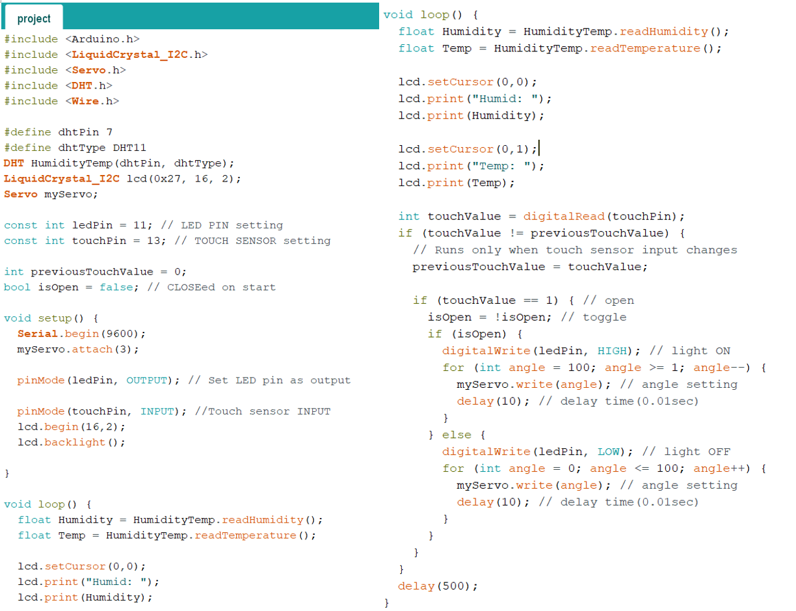
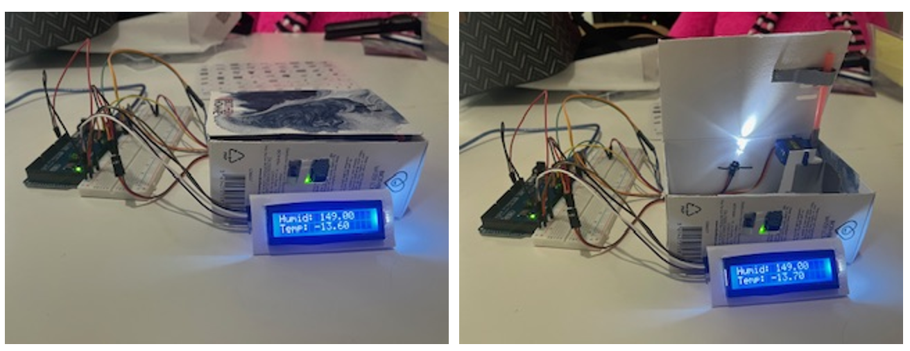

# SmartSensor - Arduino IoT Project

🖼️ Previeew Image

🎥 Demo Video:
https://youtu.be/QnuIK_kKHOE

📋 Description

This project uses an Arduino UNO to read real-time data from sensors (e.g., temperature or humidity) and display it on an LCD.  
It also activates indicators (like an LED or buzzer) based on certain thresholds to simulate an automated response.

⚙️ Technologies Used

- Arduino UNO board
- LCD display (I2C or 16x2)
- DHT11 sensor (temperature & humidity)
- LED light / Buzzer
- 5V power supply
- Arduino IDE

📁 Files

- `project.ino` – Arduino sketch with the sensor logic and display control
- `README.md` – Project overview
- `demo video` – Available via YouTube (linked above)

🚀 How It Works

1. The sensor continuously reads temperature and/or humidity.
2. The data is displayed in real-time on the LCD.
3. If a threshold is exceeded, an LED or buzzer is triggered as an alert.
4. Simple automation logic demonstrates IoT behavior.
